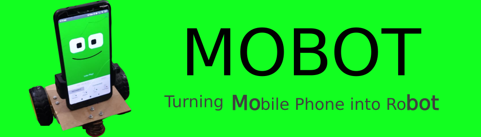

# What is Mobot?

Currently, robots are either expensive or make significant compromises on its capabilities.

Mobot is a mobile robot that leverages capabilities of mobile phone and laptop which makes it very capable but yet inexpensive.

1. **Mobile Phone:** For it rich sensor suites (i.e. camera, accelerometer, gyroscope, magnetometer, etc...) and state-of-the-art communication capabilities (i.e. WiFi, Bluetooth, etc...).
2. **Laptop:** For its powerful computational abilities and extensive language (i.e. python, c/c++) and software (i.e. ROS, OpenCV, PyTorch, etc) support.

# To get started

1. Get a chassis for mobot ([Do It Yourself](./chassis)).
2. Install Mobot app on your mobile phone. 

3. Install Mobot python package on your laptop. 

4. Now you are good to go. Follow the [tutorial here](https://github.com/mobotx/mobot/wiki) to start programming your mobot!.
